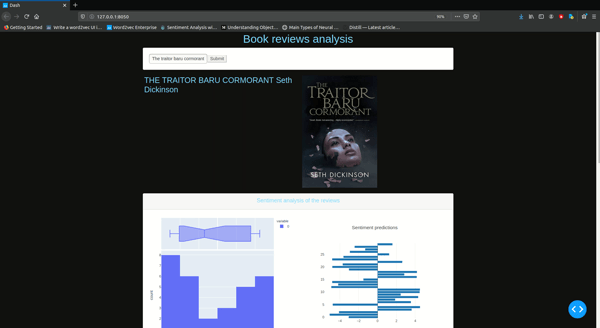

# :book: Book reviews analyzer :book: (still in progress)

This is a dashboard created with dash that analyzes book reviews from goodreads for their sentiment and looks at the most frequently used words.

## AIM

The aim of this project is to serve as a proof of knowledge for the following topics:
+   Web scrapping with Selenium
+   Dashboard creation with Dash
+   Use of neural networks for NLP

## Workflow

Upon the input of a book title by the user, the app will call a scrapper buildt with selenium that will scrap the goodreads website for the latest reviews of that book.

Once the reviews are collected, they will be processed and analyzed by a custom recursive neural network with LSTM blocks (or with a fine-tunned version of the BERT model, depending on the dashboard version).

The results are returned in the form of plotly visuals in the dashboard.

Additionally, other visuals are created to show the most frequent words used in the reviews.

## Demo

